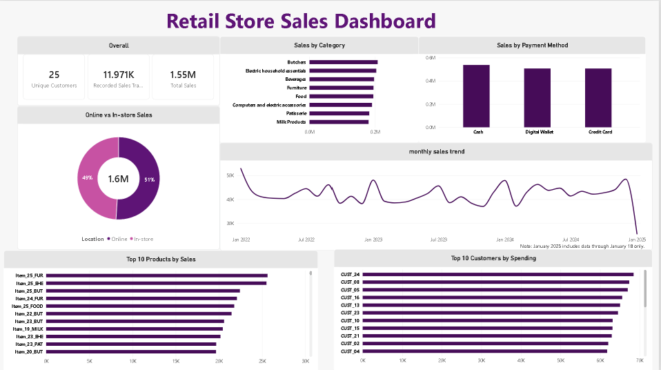

# Retail Store Sales — Data Cleaning & SQL Analysis

## 📌 Project Overview

This project focuses on cleaning, validating, and analyzing retail store sales data using SQL in Google BigQuery.

The objective is to identify data quality issues, apply reliable data-cleaning techniques, validate data integrity, and extract meaningful business insights from the cleaned dataset.

The project follows a structured data workflow:

**Data Profiling → Data Quality Checks → Data Cleaning → Numeric Data Cleaning → Validation → Business Analysis**

---

## 🎯 Objectives

- Identify and assess data quality issues
- Analyze missing values and data inconsistencies
- Recover missing values where reliable business rules exist
- Preserve data integrity without unnecessarily removing records
- Validate the cleaned dataset
- Analyze sales and product performance
- Analyze customer spending behavior
- Compare online and in-store sales
- Analyze payment methods and sales trends
- Generate meaningful business insights

---

## 🛠️ Tools & Technologies

- SQL
- Google BigQuery
- GitHub

---

## 📊 Dataset Overview

The dataset contains **12,575 retail transaction records** covering the period from **January 1, 2022 to January 18, 2025**.

| Metric | Value |
|---|---:|
| Total Records | 12,575 |
| Transactions with Recorded Sales | 11,971 |
| Customers | 25 |
| Categories | 8 |
| Date Range | 2022-01-01 → 2025-01-18 |
| Total Recorded Sales | 1,552,071 |

### Main Columns

- Transaction ID
- Customer ID
- Category
- Item
- Price Per Unit
- Quantity
- Total Spent
- Payment Method
- Location
- Transaction Date
- Discount Applied

---

## 🧹 Data Cleaning

An initial data quality assessment identified several missing-value issues.

| Column | Initial Missing Values |
|---|---:|
| Item | 1,213 |
| Price Per Unit | 609 |
| Quantity | 604 |
| Total Spent | 604 |
| Discount Applied | 4,199 |

### Item

Missing `Item` values were investigated using the relationship:

**Category + Price Per Unit → Item**

The relationship was validated to ensure that each `Category + Price Per Unit` combination corresponded to a single known item.

Missing Item values were then recovered where a reliable reference existed.

**Result: 1,213 → 0 NULL**

### Price Per Unit

Missing `Price Per Unit` values were investigated using the relationship:

**Total Spent ÷ Quantity → Price Per Unit**

The calculated values were cross-checked against known prices in the dataset before being used for recovery.

No existing records were removed during the cleaning process.

### Quantity

604 records contained missing `Quantity` values.

The relationship:

**Total Spent ÷ Price Per Unit → Quantity**

was tested, but none of the missing values could be reliably recovered as valid integer quantities.

Therefore, these values were retained as `NULL` rather than artificially imputed.

**Result: 604 NULL retained**

### Total Spent

604 records contained missing `Total Spent` values.

Because these records also lacked `Quantity`, `Total Spent` could not be reliably reconstructed using:

**Price Per Unit × Quantity**

Therefore, these values were retained as `NULL`.

**Result: 604 NULL retained**

### Discount Applied

4,199 records contained `NULL` values for `Discount Applied`.

Because the available data did not provide a reliable rule for determining whether these records represented `TRUE` or `FALSE`, the values were retained as `NULL`.

Unknown values were not artificially imputed when no reliable business rule was available.

**Result: 4,199 NULL retained**

---

## 🔎 Data Validation

After cleaning, the dataset was validated for duplicates, missing values, and numerical consistency.

| Validation Check | Result |
|---|---:|
| Total Records | 12,575 |
| Duplicate Transactions | 0 |
| Customer ID NULL | 0 |
| Category NULL | 0 |
| Item NULL | 0 |
| Price Per Unit NULL | 0 |
| Payment Method NULL | 0 |
| Location NULL | 0 |
| Transaction Date NULL | 0 |
| Quantity NULL | 604 |
| Total Spent NULL | 604 |
| Discount Applied NULL | 4,199 |

Additional validation confirmed:

- No invalid prices
- No invalid quantities
- No invalid total-spent values
- No mismatches between `Price Per Unit × Quantity` and `Total Spent` for complete records
- No duplicate transaction IDs

---

## 📈 Business Analysis

### 💰 Total Sales

**1,552,071**

Total recorded sales are calculated from the **11,971 transactions with available `Total Spent` values**.

---

### 🥩 Sales by Category

| Category | Total Sales |
|---|---:|
| Butchers | **208,118** |
| Electric household essentials | 203,813.5 |
| Beverages | 197,047.5 |
| Furniture | 195,310 |
| Food | 194,812 |
| Computers and electric accessories | 190,692.5 |
| Patisserie | 182,165.5 |
| Milk Products | **180,112** |

**Butchers** generated the highest total sales, while **Milk Products** recorded the lowest.

---

### 🏆 Top-Selling Product

**Item_25_FUR**

| Metric | Value |
|---|---:|
| Total Sales | 25,256 |
| Units Sold | 616 |
| Transactions | 113 |

---

### 🛒 Sales by Location

| Location | Total Sales |
|---|---:|
| Online | **791,401** |
| In-store | 760,670 |

Online sales were approximately **4.04% higher** than in-store sales.

---

### 💳 Sales by Payment Method

| Payment Method | Total Sales |
|---|---:|
| Cash | **537,710** |
| Digital Wallet | 507,279 |
| Credit Card | 507,082 |

Cash generated the highest total sales among the available payment methods.

---

### 📅 Yearly Sales

| Year | Total Sales |
|---|---:|
| 2022 | 510,329.5 |
| 2023 | 491,312 |
| **2024** | **524,881** |
| 2025* | 25,548.5 |

**2024 recorded the highest sales among the complete years.**

\* 2025 contains partial-year data through January 18, 2025 and should not be directly compared with complete years.

---

### 👥 Top Customer

**CUST_24**

| Metric | Value |
|---|---:|
| Total Spending | 68,452 |
| Transactions | 519 |
| Average Transaction Value | 131.89 |

---

### 📅 Monthly Sales

January recorded the highest aggregated monthly sales:

**174,421**

It also recorded the highest number of transactions:

**1,295**

> Note: Monthly results aggregate the same calendar month across all years in the dataset.

---

### 🏷️ Discount Analysis

Among transactions with a known discount status:

| Discount Applied | Transactions | Percentage |
|---|---:|---:|
| TRUE | 4,219 | 50.37% |
| FALSE | 4,157 | 49.63% |

`NULL` discount values were excluded because their discount status was unknown.

---

## 💡 Key Business Insights

- **Butchers** was the highest-performing category with **208,118** in total sales.
- **Item_25_FUR** was the top-selling individual product with **25,256** in sales.
- **Online sales** exceeded in-store sales by approximately **4.04%**.
- **Cash** generated the highest total sales among payment methods.
- **2024** was the strongest complete year in the dataset with **524,881** in sales.
- **CUST_24** was the highest-spending customer with **68,452** in total spending.
- **January** recorded the highest aggregated monthly sales at **174,421**.
- Discounted and non-discounted transactions were almost evenly distributed among records with known discount status.

---

## 📊 Dashboard

The final dashboard includes:

- Total Sales KPI
- Total Transactions KPI
- Customer Count KPI
- Sales by Category
- Online vs In-store Sales
- Monthly Sales Trend
- Top 10 Products
- Sales by Payment Method



---

## 📂 Project Structure

```text
retail-store-sales-sql-analysis/
│
├── README.md
│
├── sql/
│   ├── 01_data_profiling.sql
│   ├── 02_data_quality_checks.sql
│   ├── 03_data_cleaning.sql
│   ├── 04_numeric_data_cleaning.sql
│   ├── 05_quantity_total_cleaning.sql
│   ├── 06_cleaning_validation.sql
│   └── 07_sales_analysis.sql
│
├── dashboard/
│   └── retail_sales_dashboard.png
│
└── screenshots/
    ├── 01_bigquery_schema.png
    ├── 02_data_quality.png
    ├── 03_data_cleaning.png
    ├── 04_numeric_cleaning.png
    ├── 05_quantity_total_cleaning.png
    ├── 06_validation.png
    └── 07_business_analysis.png
